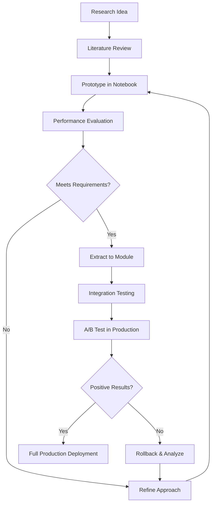

# Research Implementation Guide

## 🔬 From Research to Implementation

This guide provides practical strategies for implementing research findings, experimental features, and novel ideas into the ADR-MedDRA platform.

---

## 🎯 Implementation Framework

### 1. Research-Driven Development Process


### 2. Implementation Phases

#### Phase 1: Proof of Concept (PoC)
- **Duration**: 1-2 weeks
- **Goal**: Validate technical feasibility
- **Output**: Working prototype in notebooks
- **Success Criteria**: Core functionality demonstrates viability

#### Phase 2: Research Validation
- **Duration**: 2-4 weeks
- **Goal**: Validate research hypotheses
- **Output**: Experimental results and metrics
- **Success Criteria**: Meets or exceeds baseline performance

#### Phase 3: Production Integration
- **Duration**: 3-6 weeks
- **Goal**: Integrate into main application
- **Output**: Production-ready feature
- **Success Criteria**: Maintains system performance and reliability

---

## 🚀 Current Research Implementations

### 1. Semantic Similarity Matching

#### Research Finding
> "Sentence-BERT embeddings capture semantic meaning better than traditional TF-IDF for patient-generated text"

#### Implementation Strategy
```python
# research/prototypes/semantic_matching.py
from sentence_transformers import SentenceTransformer
import numpy as np
from sklearn.metrics.pairwise import cosine_similarity

class SemanticMatcher:
    def __init__(self, model_name="all-MiniLM-L6-v2"):
        self.model = SentenceTransformer(model_name)
        self.embeddings_cache = {}
    
    def precompute_embeddings(self, texts, cache_key):
        """Pre-compute embeddings for efficiency"""
        if cache_key not in self.embeddings_cache:
            self.embeddings_cache[cache_key] = self.model.encode(texts)
        return self.embeddings_cache[cache_key]
    
    def find_similar(self, query_text, reference_texts, top_k=5):
        """Find most similar texts using semantic similarity"""
        query_emb = self.model.encode([query_text])
        ref_emb = self.precompute_embeddings(reference_texts, "reference")
        
        similarities = cosine_similarity(query_emb, ref_emb)[0]
        top_indices = np.argsort(similarities)[-top_k:][::-1]
        
        results = []
        for idx in top_indices:
            results.append({
                "text": reference_texts[idx],
                "similarity": similarities[idx],
                "index": idx
            })
        return results
```

#### Integration Path
1. **Notebook Testing**: Validate approach in `notebooks/semantic_experiments.ipynb`
2. **Module Creation**: Extract to `src/semantic_matcher.py`
3. **Model Integration**: Update `model.py` with new matching logic
4. **Performance Testing**: Benchmark against existing TF-IDF baseline
5. **Production Deployment**: Replace existing matcher in `product/model.py`

### 2. Drug Entity Recognition Enhancement

#### Research Finding
> "Named Entity Recognition (NER) models significantly improve drug extraction accuracy over pattern-based matching"

#### Implementation Strategy
```python
# research/prototypes/enhanced_drug_extraction.py
import spacy
from transformers import AutoTokenizer, AutoModelForTokenClassification
from transformers import pipeline

class EnhancedDrugExtractor:
    def __init__(self):
        # Load multiple models for ensemble approach
        self.spacy_model = spacy.load("en_core_web_sm")
        self.ner_pipeline = pipeline("ner", 
            model="d4data/biomedical-ner-all",
            tokenizer="d4data/biomedical-ner-all"
        )
        
    def extract_drugs_ensemble(self, text):
        """Extract drugs using ensemble of methods"""
        # Method 1: SpaCy NER
        spacy_drugs = self._extract_spacy_drugs(text)
        
        # Method 2: BioBERT NER
        biobert_drugs = self._extract_biobert_drugs(text)
        
        # Method 3: Pattern-based (existing)
        pattern_drugs = self._extract_pattern_drugs(text)
        
        # Ensemble combining with confidence weighting
        return self._combine_predictions(spacy_drugs, biobert_drugs, pattern_drugs)
    
    def _extract_spacy_drugs(self, text):
        doc = self.spacy_model(text)
        drugs = []
        for ent in doc.ents:
            if ent.label_ in ["CHEMICAL", "DRUG"]:
                drugs.append({
                    "name": ent.text,
                    "confidence": 0.7,  # Base confidence for SpaCy
                    "method": "spacy"
                })
        return drugs
    
    def _extract_biobert_drugs(self, text):
        entities = self.ner_pipeline(text)
        drugs = []
        for entity in entities:
            if entity['entity'].endswith('CHEMICAL'):
                drugs.append({
                    "name": entity['word'],
                    "confidence": entity['score'],
                    "method": "biobert"
                })
        return drugs
    
    def _combine_predictions(self, *drug_lists):
        """Combine predictions from multiple methods"""
        combined = {}
        for drug_list in drug_lists:
            for drug in drug_list:
                name = drug['name'].lower()
                if name in combined:
                    # Increase confidence for multiple detections
                    combined[name]['confidence'] = min(1.0, 
                        combined[name]['confidence'] + drug['confidence'] * 0.3)
                    combined[name]['methods'].append(drug['method'])
                else:
                    combined[name] = {
                        'name': drug['name'],
                        'confidence': drug['confidence'],
                        'methods': [drug['method']]
                    }
        
        # Return sorted by confidence
        return sorted(combined.values(), 
                     key=lambda x: x['confidence'], reverse=True)
```

#### Implementation Roadmap
- **Week 1-2**: Prototype NER models in notebooks
- **Week 3-4**: Benchmark against existing pattern-based extractor
- **Week 5-6**: Integrate best-performing model into production
- **Week 7-8**: A/B test with user feedback

### 3. Confidence Calibration System

#### Research Finding
> "Model confidence scores need calibration to provide reliable uncertainty estimates for clinical use"

#### Implementation Strategy
```python
# research/prototypes/confidence_calibration.py
import numpy as np
from sklearn.calibration import CalibratedClassifierCV
from sklearn.isotonic import IsotonicRegression

class ConfidenceCalibrator:
    def __init__(self, method='isotonic'):
        self.method = method
        self.calibrator = None
        
    def fit_calibration(self, scores, true_labels):
        """Fit calibration curve on validation data"""
        if self.method == 'isotonic':
            self.calibrator = IsotonicRegression(out_of_bounds='clip')
        elif self.method == 'sigmoid':
            # Use Platt scaling
            from sklearn.linear_model import LogisticRegression
            self.calibrator = LogisticRegression()
        
        # Convert similarity scores to binary classification format
        y_binary = (np.array(true_labels) == 1).astype(int)
        self.calibrator.fit(scores.reshape(-1, 1), y_binary)
        
    def calibrate_score(self, score):
        """Return calibrated probability"""
        if self.calibrator is None:
            return score  # Return uncalibrated if not fitted
        
        return self.calibrator.predict_proba([[score]])[0, 1]
    
    def calibrate_predictions(self, predictions):
        """Calibrate all predictions in a batch"""
        for pred in predictions:
            pred['calibrated_score'] = self.calibrate_score(pred['score'])
            pred['confidence_level'] = self._get_confidence_level(pred['calibrated_score'])
        return predictions
    
    def _get_confidence_level(self, score):
        """Convert score to interpretable confidence level"""
        if score >= 0.9:
            return "Very High"
        elif score >= 0.7:
            return "High"
        elif score >= 0.5:
            return "Medium"
        elif score >= 0.3:
            return "Low"
        else:
            return "Very Low"
```

---

## 🔄 Experimental Features Pipeline

### 1. Multi-Language Support

#### Research Question
*"Can we extend ADR mapping to non-English patient reports?"*

#### Implementation Plan
```python
# Prototype: Multi-language ADR mapping
class MultilingualADRMapper:
    def __init__(self):
        self.translators = {
            'es': pipeline('translation', model='Helsinki-NLP/opus-mt-es-en'),
            'fr': pipeline('translation', model='Helsinki-NLP/opus-mt-fr-en'),
            'de': pipeline('translation', model='Helsinki-NLP/opus-mt-de-en')
        }
        self.language_detector = pipeline('text-classification', 
                                         model='facebook/fasttext-language-identification')
    
    def map_multilingual_adr(self, text):
        # 1. Detect language
        lang = self.detect_language(text)
        
        # 2. Translate if not English
        if lang != 'en':
            text = self.translate_to_english(text, lang)
        
        # 3. Apply existing ADR mapping
        return self.existing_mapper.predict(text)
```

**Timeline**: 3-4 months
**Resources**: Native speakers for validation, multilingual datasets

### 2. Temporal ADR Pattern Detection

#### Research Question
*"Can we identify temporal patterns in ADR onset and duration?"*

#### Implementation Approach
```python
# Prototype: Temporal pattern extraction
class TemporalADRAnalyzer:
    def __init__(self):
        self.temporal_patterns = [
            r'(\d+)\s+(days?|weeks?|months?)\s+after',
            r'started\s+(\d+)\s+(hours?|days?)',
            r'within\s+(\d+)\s+(minutes?|hours?)'
        ]
    
    def extract_temporal_info(self, text):
        """Extract timing information from ADR reports"""
        temporal_data = []
        for pattern in self.temporal_patterns:
            matches = re.finditer(pattern, text, re.IGNORECASE)
            for match in matches:
                temporal_data.append({
                    'value': int(match.group(1)),
                    'unit': match.group(2),
                    'context': match.group(0)
                })
        return temporal_data
    
    def analyze_onset_patterns(self, adr_reports):
        """Analyze patterns across multiple reports"""
        onset_data = []
        for report in adr_reports:
            temporal_info = self.extract_temporal_info(report['text'])
            if temporal_info:
                onset_data.append({
                    'drug': report['drug'],
                    'adr': report['adr'],
                    'onset_time': temporal_info[0]
                })
        return self.statistical_analysis(onset_data)
```

### 3. Causal Relationship Inference

#### Research Question
*"Can we automatically infer causal relationships between drugs and ADRs?"*

#### Implementation Strategy
```python
# Prototype: Causal inference system
class CausalInferenceEngine:
    def __init__(self):
        self.causal_indicators = [
            'caused by', 'due to', 'because of', 'resulted from',
            'after taking', 'since starting', 'following'
        ]
        self.uncertainty_indicators = [
            'might be', 'possibly', 'could be', 'perhaps',
            'not sure if', 'wondering if'
        ]
    
    def infer_causality(self, text, drug, adr):
        """Infer likelihood of causal relationship"""
        # 1. Linguistic pattern analysis
        causal_score = self._analyze_causal_patterns(text)
        
        # 2. Temporal proximity analysis
        temporal_score = self._analyze_temporal_proximity(text, drug, adr)
        
        # 3. Knowledge base lookup
        knowledge_score = self._lookup_known_associations(drug, adr)
        
        # 4. Combine scores
        final_score = self._combine_causal_scores(
            causal_score, temporal_score, knowledge_score
        )
        
        return {
            'causality_score': final_score,
            'confidence': self._calculate_confidence(final_score),
            'evidence': self._extract_evidence(text)
        }
```

---

## 📊 Implementation Validation Framework

### 1. A/B Testing Infrastructure

```python
# research/validation/ab_testing.py
class ABTestFramework:
    def __init__(self):
        self.experiments = {}
        self.user_assignments = {}
    
    def create_experiment(self, name, variants, traffic_split):
        """Create new A/B test experiment"""
        self.experiments[name] = {
            'variants': variants,
            'traffic_split': traffic_split,
            'metrics': {},
            'start_date': datetime.now()
        }
    
    def assign_user(self, user_id, experiment_name):
        """Assign user to experiment variant"""
        if experiment_name not in self.experiments:
            return 'control'
        
        # Consistent assignment based on user_id hash
        hash_value = hash(f"{user_id}_{experiment_name}") % 100
        cumulative = 0
        
        for variant, percentage in self.experiments[experiment_name]['traffic_split'].items():
            cumulative += percentage
            if hash_value < cumulative:
                self.user_assignments[user_id] = variant
                return variant
        
        return 'control'
    
    def track_metric(self, experiment_name, variant, metric_name, value):
        """Track experiment metrics"""
        if experiment_name not in self.experiments:
            return
        
        metrics = self.experiments[experiment_name]['metrics']
        if variant not in metrics:
            metrics[variant] = {}
        if metric_name not in metrics[variant]:
            metrics[variant][metric_name] = []
        
        metrics[variant][metric_name].append(value)
```

### 2. Performance Benchmarking

```python
# research/validation/benchmarking.py
import time
import psutil
import numpy as np

class PerformanceBenchmark:
    def __init__(self):
        self.metrics = {}
    
    def benchmark_function(self, func, *args, **kwargs):
        """Benchmark function performance"""
        # Memory before
        process = psutil.Process()
        memory_before = process.memory_info().rss / 1024 / 1024  # MB
        
        # Time execution
        start_time = time.time()
        result = func(*args, **kwargs)
        end_time = time.time()
        
        # Memory after
        memory_after = process.memory_info().rss / 1024 / 1024  # MB
        
        return {
            'result': result,
            'execution_time': end_time - start_time,
            'memory_used': memory_after - memory_before,
            'peak_memory': memory_after
        }
    
    def compare_implementations(self, implementations, test_data):
        """Compare multiple implementation approaches"""
        results = {}
        
        for name, impl_func in implementations.items():
            times = []
            memories = []
            
            # Run multiple iterations
            for data in test_data[:10]:  # Test on first 10 samples
                metrics = self.benchmark_function(impl_func, data)
                times.append(metrics['execution_time'])
                memories.append(metrics['memory_used'])
            
            results[name] = {
                'avg_time': np.mean(times),
                'std_time': np.std(times),
                'avg_memory': np.mean(memories),
                'std_memory': np.std(memories)
            }
        
        return results
```

---

## 🔧 Implementation Best Practices

### 1. Research Code Organization

```
research/
├── prototypes/           # Experimental implementations
│   ├── semantic_matching.py
│   ├── enhanced_drug_extraction.py
│   └── confidence_calibration.py
├── experiments/          # Experiment notebooks
│   ├── semantic_similarity_study.ipynb
│   ├── drug_extraction_comparison.ipynb
│   └── confidence_calibration_analysis.ipynb
├── validation/           # Testing and validation tools
│   ├── ab_testing.py
│   ├── benchmarking.py
│   └── evaluation_metrics.py
└── datasets/            # Research-specific datasets
    ├── validation_sets/
    └── benchmark_data/
```

### 2. Implementation Workflow

#### Step 1: Research Notebook
```python
# Start with exploratory analysis
# research/experiments/new_feature_exploration.ipynb

# 1. Load and explore data
data = load_research_data()
explore_data_patterns(data)

# 2. Implement prototype
prototype = NewFeaturePrototype()
results = prototype.test_approach(data)

# 3. Evaluate against baseline
baseline_results = baseline_model.predict(data)
comparison = compare_results(results, baseline_results)

# 4. Document findings
document_experiment_results(comparison)
```

#### Step 2: Extract to Module
```python
# research/prototypes/new_feature.py
class NewFeature:
    """Production-ready implementation of research prototype"""
    
    def __init__(self, config):
        self.config = config
        self.model = self._initialize_model()
    
    def process(self, input_data):
        """Main processing method"""
        # Implementation based on research findings
        pass
    
    def _initialize_model(self):
        """Initialize underlying model"""
        pass
```

#### Step 3: Integration Testing
```python
# tests/test_new_feature.py
import unittest
from research.prototypes.new_feature import NewFeature

class TestNewFeature(unittest.TestCase):
    def setUp(self):
        self.feature = NewFeature(config={'param': 'value'})
    
    def test_basic_functionality(self):
        result = self.feature.process(test_input)
        self.assertIsNotNone(result)
    
    def test_performance_requirements(self):
        # Test against performance benchmarks
        start_time = time.time()
        self.feature.process(large_input)
        execution_time = time.time() - start_time
        self.assertLess(execution_time, 1.0)  # Must complete in <1s
```

### 3. Research-to-Production Pipeline



---

## 📈 Success Metrics for Implementations

### Technical Metrics
- **Performance**: Response time < 100ms for 95% of requests
- **Accuracy**: Improvement over baseline by ≥5%
- **Memory Usage**: ≤2GB RAM for full model loading
- **Throughput**: ≥100 requests/second

### User Experience Metrics
- **Task Completion Rate**: ≥90% successful completions
- **User Satisfaction**: ≥4.0/5.0 average rating
- **Error Rate**: ≤2% of user sessions encounter errors
- **Adoption Rate**: ≥70% of users try new features

### Business Impact Metrics
- **Time Savings**: ≥30% reduction in manual coding time
- **Accuracy Improvement**: ≥15% better than manual coding
- **User Retention**: ≥80% monthly active users
- **Clinical Utility**: Positive feedback from healthcare professionals

---

*Implementation Guide Version: 1.0*  
*Last Updated: December 17, 2025*  
*Maintained by: Research & Development Team*